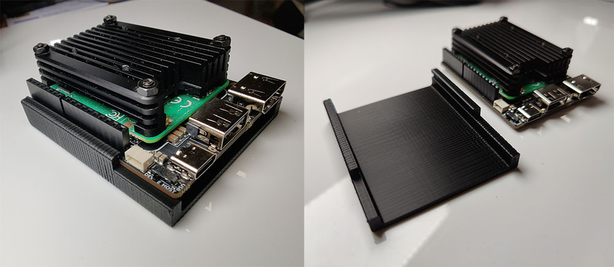

# Piunora-Bottom-Protector
A little 3D printable shim to protect the underside of your Piunora

The 3MF file is for printing. 3MF serves the same purpose as STL but comes with some very necessary improvements to make sure files are interpreted correctly across software.

The model is oriented in the intended printing orientation.

Preview is printed with 0.2mm nozzle and 0.2mm layer height.

The case is a press fit and might be a bit tough to insert depending on your printer and print settings. Please be careful to not hurt yourself or your Piunora. Remove the SD card and don't hold it at the pin headers when inserting it or you may risk bending them.

